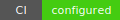
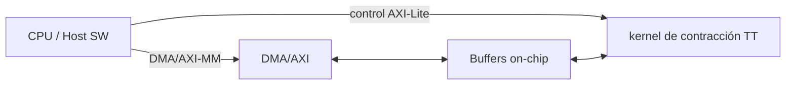

# TFM Co-diseño IA+FPGA: Tensor-Train (TT) y kernel de contracción TT en FPGA



## Problema
- En inferencia en borde, las capas lineales son bandwidth-bound y el coste de memoria domina; esto penaliza SWaP / determinismo / soberanía.
- El tráfico a DDR introduce latencia variable y limita la repetibilidad temporal.

## Solución
- Compresión Tensor-Train (TT) de pesos y ejecución con kernel de contracción TT en FPGA.
- Streaming con buffers locales para reducir tráfico a DDR y estabilizar la latencia.

## Qué se entrega
- Demo CPU reproducible en NumPy (TT-SVD + referencia densa) con salidas en `docs/assets/`.
- Skeleton HLS/RTL con interfaces AXI, mapa de registros y supuestos explícitos en `hw/`.
- Paquete Indra con onepager, pitchdeck, techbrief y evidence pack.

## Quickstart
```bash
python -m pip install -r requirements.txt
make demo
make benchmarks
make test
```
En Windows, usar `make.bat` si `make` no está disponible.
Salidas principales: `docs/assets/demo_output.txt`, `docs/assets/kpi_table.md`, `docs/assets/bench_tradeoff.png`.

## Arquitectura


## KPIs
| KPI | Definición | Estado |
| --- | --- | --- |
| Compresión efectiva TT (demo CPU) | Ratio dense/TT para ranks evaluados | Medido (ver [kpi_table.md](docs/assets/kpi_table.md)) |
| Error relativo L2 (demo CPU) | Error relativo de salida vs dense | Medido (ver [kpi_table.md](docs/assets/kpi_table.md)) |
| Tiempo TT vs dense (us, demo CPU) | Mediana en host CPU | Medido (ver [kpi_table.md](docs/assets/kpi_table.md)) |
| Latencia por contracción TT (us) | Tiempo por llamada del kernel de contracción TT en FPGA | Objetivo (TBD) |
| Throughput efectivo (GFLOP/s) | Rendimiento sostenido del kernel de contracción TT | Objetivo (TBD) |
| Uso de recursos FPGA (LUT/FF/BRAM/DSP, %) | Porcentaje de utilización del dispositivo objetivo | Objetivo (TBD) |
| Consumo medio (W) | Potencia media bajo carga representativa | Objetivo (TBD) |
| Determinismo (jitter p99, us) | Variación temporal p99 por llamada | Objetivo (TBD) |

## Evidence


El gráfico resume el trade-off compresión/error medido en CPU; la tabla KPI añade tiempos (mediana) por rank.
Activos generados con `make benchmarks`:
- `docs/assets/bench_results.csv`
- `docs/assets/bench_tradeoff.png`
- `docs/assets/kpi_table.md`

Activos generados con `make demo`:
- `docs/assets/demo_output.txt`

## Indra Package
- [onepager.md](docs/indra/onepager.md)
- [pitchdeck.md](docs/indra/pitchdeck.md)
- [techbrief.md](docs/indra/techbrief.md)
- [evidence_pack.md](docs/indra/evidence_pack.md)

## Repo map
- `ml/`: prototipos de compresión Tensor-Train (TT) y validación con TT-SVD.
- `hw/README.md`: interfaces HW, layout de cores TT, mapa de registros y plan de V&V.
- `hw/`: skeleton HW con `hls/` y `rtl/`.
- `sw/`: integración SW y drivers (placeholder).
- `scripts/`: demos, benchmarks y empaquetado Indra.
- `docs/indra/`: documentos ejecutivos para Indra.
- `docs/assets/`: salidas reproducibles y evidencias.

## Reproducibilidad y limitaciones
Los scripts fijan semilla y guardan salidas en `docs/assets`. No se versionan pesos grandes ni datasets reales; se usan datos sintéticos reproducibles.

### Decisiones de diseño
- Separación SW/HW para validar matemáticas en CPU antes de integrar HW.
- Interfaz HW/SW basada en AXI4-Lite (control) y AXI-Stream/DMA (datos).
- Evidencias versionadas (CSV/PNG/MD) para trazabilidad técnica.

### Limitaciones actuales
- No hay kernel HLS funcional ni bitstream FPGA; el HW está en skeleton.
- Benchmarks actuales son CPU con NumPy; no representan rendimiento FPGA.
- Sin cuantización ni soporte de ranks dinámicos por batch.


