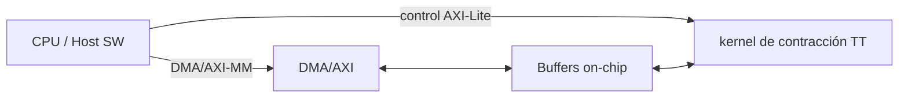

# TFM Co-diseno IA+FPGA: Tensor-Train (TT) y kernel de contracción en FPGA

## Why this matters
Las capas lineales suelen ser bandwidth-bound y dominan el coste en inferencia. Un kernel de contracción TT en FPGA permite mantener datos en buffers locales y controlar latencia, con impacto directo en SWaP / determinismo / soberanía en despliegues en borde.

## What you get
- Demo reproducible de contracción Tensor-Train (TT) en CPU con salida en `docs/assets`.
- Scripts de benchmark y auditoría de evidencia para preparar métricas base.
- Paquete Indra con onepager, pitchdeck, techbrief y evidence pack.

## Demo Quickstart
```bash
python -m pip install -r requirements.txt
python -m scripts.demo_tt_linear
python -m scripts.wow_audit
```
Salidas: `docs/assets/demo_output.txt`, `docs/assets/kpi_table.md`.

## Arquitectura


## KPI targets
| KPI | Definición | Estado |
| --- | --- | --- |
| Latencia por contracción TT (us) | Tiempo por llamada del kernel de contracción TT en FPGA | Objetivo (TBD) |
| Throughput efectivo (GFLOP/s) | Rendimiento sostenido del kernel de contracción TT | Objetivo (TBD) |
| Uso de recursos FPGA (LUT/FF/BRAM/DSP, %) | Porcentaje de utilización del dispositivo objetivo | Objetivo (TBD) |
| Consumo medio (W) | Potencia media bajo carga representativa | Objetivo (TBD) |
| Determinismo (jitter p99, us) | Variación temporal p99 por llamada | Objetivo (TBD) |

## Evidence


Activos generados con `make benchmarks`:
- `docs/assets/bench_results.csv`
- `docs/assets/kpi_table.md`
- `docs/assets/demo_output.txt`

## Indra Package
- [onepager.md](docs/indra/onepager.md)
- [pitchdeck.md](docs/indra/pitchdeck.md)
- [techbrief.md](docs/indra/techbrief.md)
- [evidence_pack.md](docs/indra/evidence_pack.md)

## Repo map
- `ml/`: prototipos de compresion Tensor-Train (TT) y validacion.
- `hw/`: skeleton HW con `hls/` y `rtl/`.
- `sw/`: integracion SW y drivers (placeholder).
- `scripts/`: demos, benchmarks y empaquetado Indra.
- `docs/indra/`: documentos ejecutivos para Indra.
- `docs/assets/`: salidas reproducibles y evidencias.

## Reproducibilidad y limitaciones
Los scripts fijan seeds y guardan outputs en `docs/assets`. No se versionan pesos grandes; se usan datos sinteticos reproducibles.

### Decisiones de diseño
- Separacion SW/HW para aislar V&V y facilitar integracion incremental.
- Interfaz HW/SW planificada con control AXI-Lite y flujo de datos por DMA/AXI.
- Evidencias versionadas: outputs deterministas y auditables en `docs/assets`.

### Limitaciones actuales
- No hay kernel HLS ni bitstream FPGA; el HW esta en skeleton.
- Benchmarks actuales son CPU con NumPy; no representan rendimiento FPGA.
- No se incluyen pesos grandes ni datasets reales por tamaño o licencias.

## Contacto
[TU_EMAIL] | [TU_LINKEDIN]
