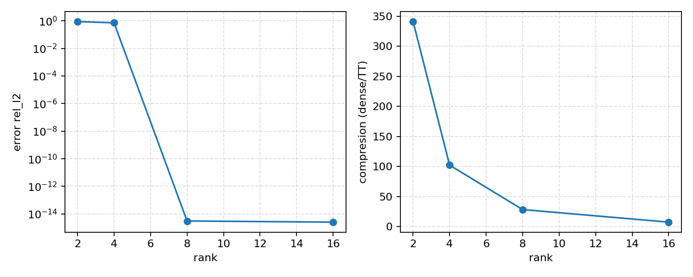

# TFM Co-diseno IA+FPGA: Tensor-Train (TT) y kernel de contracción en FPGA
## Co-diseno IA+FPGA para capas lineales

---

## Problema
- Capas lineales bandwidth-bound y coste dominante en inferencia.
- Necesidad de SWaP / determinismo / soberanía en borde.

---

## Solución
- Compresión Tensor-Train (TT) para pesos de capas lineales.
- Kernel de contracción TT en FPGA con streaming y control AXI.

---

## Arquitectura (HLD)
- AXI4-Lite para control y estado.
- AXI-Stream/DMA para activaciones y cores TT.
- Buffers locales y pipeline de MAC + acumulación.

---

## KPIs
| KPI | Definición | Estado |
| --- | --- | --- |
| Compresión efectiva TT (demo CPU) | Ratio dense/TT para ranks evaluados | Medido (ver [kpi_table.md](../assets/kpi_table.md)) |
| Error relativo L2 (demo CPU) | Error relativo de salida vs dense | Medido (ver [kpi_table.md](../assets/kpi_table.md)) |
| Tiempo TT vs dense (us, demo CPU) | Mediana en host CPU | Medido (ver [kpi_table.md](../assets/kpi_table.md)) |
| Latencia por contracción TT (us) | Tiempo por llamada del kernel de contracción TT en FPGA | Objetivo (TBD) |
| Throughput efectivo (GFLOP/s) | Rendimiento sostenido del kernel de contracción TT | Objetivo (TBD) |
| Uso de recursos FPGA (LUT/FF/BRAM/DSP, %) | Porcentaje de utilización del dispositivo objetivo | Objetivo (TBD) |
| Consumo medio (W) | Potencia media bajo carga representativa | Objetivo (TBD) |
| Determinismo (jitter p99, us) | Variación temporal p99 por llamada | Objetivo (TBD) |

---

## Evidencia (demo CPU)

Tabla KPI: [kpi_table.md](../assets/kpi_table.md)

---

## Plan
1. Kernel HLS con pipeline y backpressure.
2. Integración HW/SW con DMA y layout de cores TT.
3. Medición de KPIs HW en plataforma objetivo.

---

## Ask to Indra
- Validación de plataforma FPGA y restricciones de interfaz.
- Definición de perfiles de carga y límites de SWaP / determinismo / soberanía.
- Mentorización técnica y revisión de V&V.
